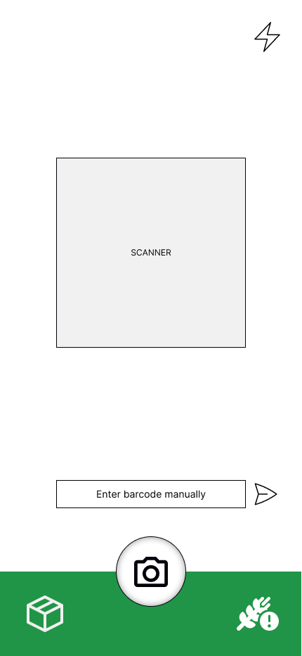
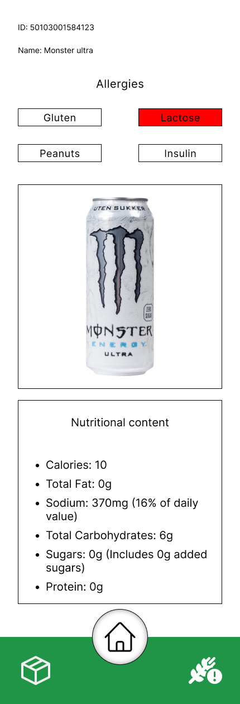
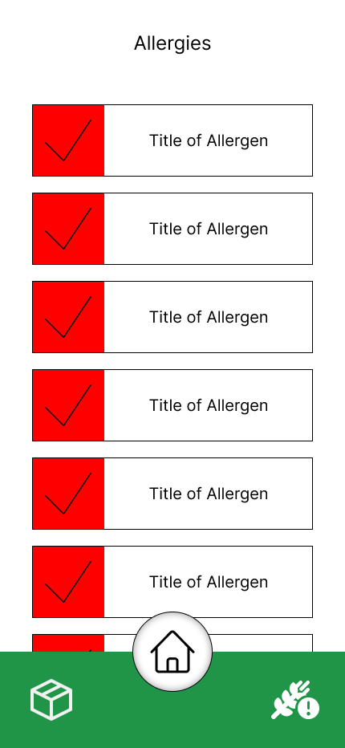

[Design](https://www.figma.com/file/RB02EE4zorj5LwuhkXogdW/Allergy-App?type=design&node-id=0%3A1&mode=design&t=ltocGRlCOggKFK5C-1)
# Epics:
### Product Information:
* As a user, I want to scan a barcode on a product to retrieve allergy information.
* As a user, I want to be able to input the code underneath the barcode scanner to access the same information if there is an issue.
### Allergy Management:
As a user, I want to input my allergies into the app.
As a user, I want the app to notify me if a scanned product contains any allergens I'm sensitive to.
### Product Search:
As a user, I want to search for a product by name or category.
### Barcode Database:
As a user, I want the app to have an extensive database of barcodes and product information.
## User Stories:
### Epic: Product Information
As a user, I want to scan a product barcode.
### Acceptance Criteria:
Scanning a product displays relevant information.
As a user, I want to view detailed allergy information for a product.
### Acceptance Criteria:
The app displays allergen details for each scanned product.
### Epic: Allergy Management
As a user, I want to input my allergies.
### Acceptance Criteria:
The app allows users to add and manage their allergies.
As a user, I want to be notified if a scanned product contains allergens I'm sensitive to.
### Acceptance Criteria:
The app sends a notification or highlights allergens on the product screen.
### Epic: Product Search
As a user, I want to search for a product by name.
### Acceptance Criteria:
The app has a search functionality.
Searching for a product provides relevant results.
As a user, I want to browse products by category.
### Acceptance Criteria:
The app categorizes products for easy browsing.
### Epic: Barcode Database
As a user, I want the app to have an extensive barcode database.
### Acceptance Criteria:
The app integrates with a comprehensive barcode database.

---

# Barcode Allergen Scanner

## Project Name:
Barcode Allergen Scanner

## Description:
The Barcode Allergen Scanner is a web application designed to help users quickly access allergy information for various food products while shopping. Implemented using HTML, JavaScript, and CSS, the app allows users to scan product barcodes or manually input codes to retrieve detailed allergy information.

## Demo or Screenshots:
[Link to Figma Design](https://www.figma.com/file/RB02EE4zorj5LwuhkXogdW/Allergy-App?type=design&node-id=0%3A1&mode=design&t=ltocGRlCOggKFK5C-1)

- Home screen image (image of the homepage in the barcodescanner-app)
  

- Product page image ( image of the productpage in the barcodescanner-app)
  

- Filter app screen ( image of the filterpage in the barcodescanner-app)
  

## Features:
- Scan various barcode formats (UPC, QR codes, etc.).
- Real-time scanning feedback.
- Support for multiple browsers and devices.

## Technologies Used:
- HTML
- JavaScript
- CSS
- Figma (for design)

## Installation:
[Link to live demo](#) (Deployed using Netlify)

## Usage:
1. Scan or input product barcode.
2. View allergy information for the scanned product.
3. Manage personal allergies within the app.

## Configuration:
Users can customize their allergy preferences within the app settings.

## Credits:
- Jonas Netli (Project Manager) - [https://github.com/JNettli](#)
- Chris Berg (UI/UX Designer) - [https://github.com/ChrisBerg03](#)
- Abdulla Al Harun (Lead Developer) - [https://github.com/AbdullaAlHarun](#)
- Aksel Oldeide (Database Manager) - [https://github.com/AkselOldeide](#)
- Christian Westby (Quality Assurance) - [https://github.com/ChristianWestby](#)

## License:
This project is licensed under the MIT License. See the [LICENSE](LICENSE) file for more details.

## Contributing:
This project is not open for direct contributions but is available for forking.

## Known Issues/Limitations:
- Limited support for certain barcode formats.
- Potential performance issues on older devices.

## Future Improvements:
- Enhanced support for additional barcode formats.
- Integration with external databases for more comprehensive allergy information.

## Changelog:
- v1.0: Initial release (date)
- v1.1: Bug fixes and performance improvements (date)

---

Feel free to customize any sections further to better suit your project's needs!