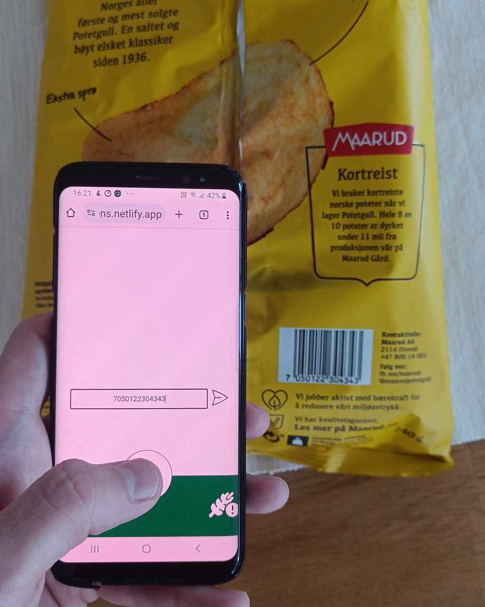
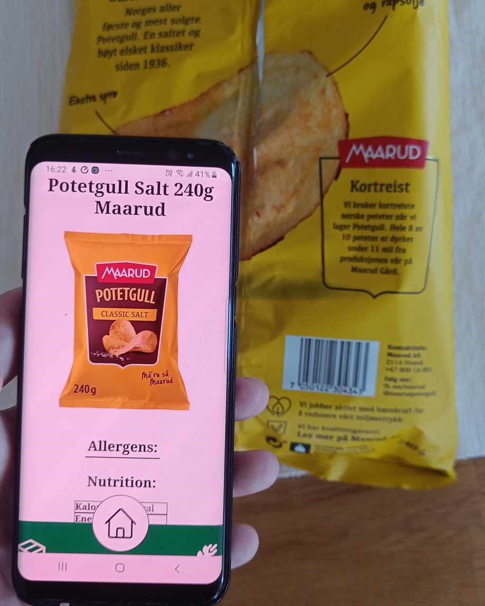

# Barcode Allergen Scanner - ║▌║█║▌│║▌║▌█

## Description:
The Barcode Allergen Scanner is a web application designed to help users quickly access allergy information for various food products while shopping. Implemented using HTML, JavaScript, and CSS, the app allows users to manually input codes to retrieve detailed allergy information. The application is for the moment intended for mobile only, as a mobile viewport device is typically what you would carry in a store.

## Demo or Screenshots:

## Features:
- Input barcodes to scan products for allergens instantly.
- JavaScript form validation to only allow numeral 13-digit inputs
- Data about product is retrieved from the [kassalapp API](https://kassal.app/api)
- Define your allergies in the application to give a feedback on allergens. Allergies are stored with a "true" value in the local storage
- Products can also be found via the [product list](https://midnightfalcons.netlify.app/productlist)
- Nifty scanning animation to simulate actual barcode scanning functionality.

## Technologies Used:
- HTML
- JavaScript
- CSS
- Figma - [Link to design](https://www.figma.com/file/RB02EE4zorj5LwuhkXogdW/Allergy-App?type=design&node-id=0%3A1&mode=design&t=ltocGRlCOggKFK5C-1)
- [API](https://kassal.app/api)

## Installation:
[Link to live demo](https://midnightfalcons.netlify.app) (Deployed using Netlify)

## Usage:
1. Manage personal allergies within the the [profile page ](https://midnightfalcons.netlify.app/profile). (Selected allergens are stored with a true value in local storage to indicate intollerance.)
2. input product barcode EAN number on the [index page](https://midnightfalcons.netlify.app). Click the button to proceed
2. View allergy information for the scanned product. Allergens that correspond with your previously defined allergies are highlighted in red.

## Navigation:
The page uses a footer for navigation, containing the following symbol buttons: 
- 🏠 Home - Navigates to the index page with the EAN input
- 📷 Camera - (Only present when on the index page). Runs an animation to simulate an actual barcode scanner
- 🌿 Allergies - navigates to the profile page with the allergen selection
- 📦 Product list  - Navigates to the product list which contains a list of all products available.  

## Configuration:
Users can customize their allergy preferences within the [profile page](https://midnightfalcons.netlify.app/profile) settings.

## Credits:
- [Jonas Netli](https://github.com/JNettli)
- [Chris Berg](https://github.com/ChrisBerg03)
- [Abdulla Al Harun](https://github.com/AbdullaAlHarun)
- [Aksel Oldeide](https://github.com/AkselOldeide)
- [Christian Westby](https://github.com/ChristianWestby)

## License:
This project is licensed under the MIT License. See the [LICENSE](LICENSE) file for more details.

## Contributing:
This project is not open for direct contributions but is available for forking.

## Known Issues/Limitations:
- Limited support for certain barcode formats - Currently supporting only EAN (European barcodes)
- Barcode image scanner is not functional - An animation is used instead. 
- Allergen filter not functional in product list
- External API does only support fetch calls of up to 100 entries at a time. (Limited to 100 calls a minute)

## Future Improvements:
- Enhanced support for additional barcode formats.
- Performance

## Changelog:
- v1.0: Current release

